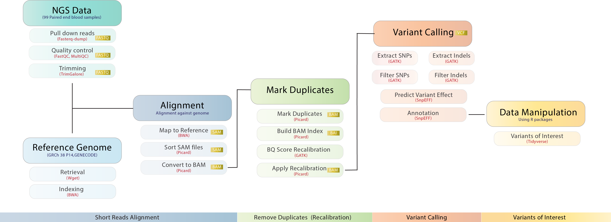

# **Exploring Genomic Newborn Screening using Next Generation Sequencing (NGS) Data**


## **Background**

Newborn screening (NBS) aim at identifying neonates in need of immediate life-saving treatment to improve health outcomes, or reduce morbidity through immediate, pre-symptomatic treatment (Veldman et al., 2022). NBS started early in the 1960s with focus on phenylketonuria (PKU) to prevent severe intellectual disability (Guthrie & Susi, 1963). Advancements in technology and improved scientific knowledge over time have expanded NBS to include multiple disorders.

NBS programs are predominantly used for inherited metabolic disorders (IMDs) with a monogenetic origin. It is noteworthy that NBS  countries  but some countries screen for genetic non-IMDs as well (Veldman et al., 2022). About 33.3% of the global newborn population benefit from NBS currently. However, most of them residing in countries with developing only receive screening for a single condition while those in developed countries may be screened for over 50 conditions (Therrell et al., 2015).

The current NBS programs in Africa are predominantly along the coast and organized NBS within the African continent is limited (Therrell  Jr et al., 2020). The implementation of NBS in Africa faces major challenges related to contact tracing, time of sample collection, and scarcity of resources among others. Therefore, this project aims at identifying novel variants associated with metabolic disorders among neonates living in Africa.

## **Objectives**

1. Validation of our curated gNBS gene-panel for a subset of existent congenital disorders
2. Identification of novel variants associated with key metabolic disorders in neonates
3. Linking of these variants to the associated physiological diseased states in neonates


## **Significance of the study**

Blood sample dependent NBS programs are dependent on technologies such as mass spectrometry and genetic sequencing. The routine application of next-generation sequencing (NGS) in clinical laboratories has given rise to significant opportunities for NBS, thereby improving health among infants and children. It is noteworthy that NBS is an effective strategy in the prevention of inborn errors of metabolism (IEM) with emphasis on timely detection of deteriorating health outcomes and early treatment. While critical to improving survival and associated cost effectiveness, the implementation of NBS is particularly challenging in low-income, high-burden settings such as those in much of Africa (Kato et al., 2018).

## **Methods**

## **Workflow**


## **Tools used in the Analysis**
1.Fasterq-dump,
2.FastQC,
3.Trim Galore,
4.MultiQC,
5.wget,
6.Burrows-Wheeler Aligner


###### Software Installation:
 ```bash
#Fastqc v0.11.9
wget https://www.bioinformatics.babraham.ac.uk/projects/fastqc/fastqc_v0.11.9.zip
```

``` bash
##BWA:
apt-get -y install bwa=0.7.17-1
```

```bash
#GATK
cd /opt/
export GATK_PACKAGE="gatk.zip"
wget -O $GATK_PACKAGE https://github.com/broadinstitute/gatk/releases/download/4.2.2.0/gatk-4.2.2.0.zip
unzip ${GATK_PACKAGE}
rm -v ${GATK_PACKAGE}
ln -svf /opt/gatk-4.2.2.0/gatk /usr/local/bin/
gatk --version 2>&1 | tail -3
```

```bash
#Picard
apt-get install -y picard-tools=2.8.1+dfsg-3
```

```bash
#snpEff
cd /opt
# Download latest version
wget https://snpeff.blob.core.windows.net/versions/snpEff_latest_core.zip
# Unzip file
unzip snpEff_latest_core.zip
rm -v snpEff_latest_core.zip
alias snpeff="java -jar /opt/snpEff/snpEff.jar"
snpeff -version
```

## **Input and Output Flow of the steps**
1. Fasterq-dump (input is list of accessions, output is paired-end .fq files)
2. FastQC (input: Fastqs, output: MultiQC reports in .html, .txt)
3. MultiQC (input is FastQC reports in .html,.txt, output is MultiQC reports consolidated in .html,.txt)
4. Trim Galore (input: Fastqs, output: Fastqs with adapters removed)
5. MultiQC (input is FastQC reports in .html,.txt, output is MultiQC reports consolidated in .html,.txt)
6. wget: (input is URL for Gencode's GRCh38.p14, output is fastqs, annotations etc.)
7. Burrows-Wheeler Aligner (Indexing): (input is path to Gencode's GRCh38.p14, output is a database or an index of the human genome)
8. Burrows-Wheeler Aligner (Mapping): (input: prefix/path to human genome index and path to paired-end Fastq files/reads, output: Sequence Alignment Maps/.sam files)

## **Future Prospects for Our project**
1. Developing functionally validated reproducible pipelines for genomic NBS data analysis and interpretation
 i.e. Using Bioinformatics frameworks such as Nextflow and Snakemake
2. Develop a functional African-specific gNBS analysis pipeline for use in routine Clinical Practice

## **Team Members**

1.	[Rissy Wesonga](https://github.com/Rissy2021) – Project team lead
2.	[Olaitan I. Awe](https://github.com/laitanawe) – Project co-lead
3.	[Annassiri Fatima Zahara](https://github.com/f-annassiri) - Technical team lead

The first version of the README was drafted by [Pauline King’ori](https://twitter.com/paulah_kings)

## **References**

Kato, G. J., Piel, F. B., Reid, C. D., Gaston, M. H., Ohene-Frempong, K., Krishnamurti, L., Smith, W. R., Panepinto, J. A., Weatherall, D. J., Costa, F. F., & Vichinsky, E. P. (2018). Sickle cell disease. Nature Reviews. Disease Primers, 4, 18010. https://doi.org/10.1038/nrdp.2018.10

Therrell  Jr, B. L., Lloyd-Puryear, M. A., Ohene-Frempong, K., Ware, R. E., Padilla, C. D., Ambrose, E. E., Barkat, A., Ghazal, H., Kiyaga, C., Mvalo, T., Nnodu, O., Ouldim, K., Rahimy, M. C., Santos, B., Tshilolo, L., Yusuf, C., Zarbalian, G., Watson, M. S., & faculty and speakers at the First Pan African Workshop on Newborn Screening  Morocco, June 12-14, 2019, R. (2020). Empowering newborn screening programs in African countries through establishment of an international collaborative effort. Journal of Community Genetics, 11(3), 253–268. https://doi.org/10.1007/s12687-020-00463-7

Therrell, B. L., Padilla, C. D., Loeber, J. G., Kneisser, I., Saadallah, A., Borrajo, G. J. C., & Adams, J. (2015). Current status of newborn screening worldwide: 2015. Seminars in Perinatology, 39(3), 171–187. https://doi.org/10.1053/j.semperi.2015.03.002

Veldman, A., Kiewiet, M. B. G., Heiner-fokkema, M. R., Nelen, M. R., Sinke, R. J., Sikkema-raddatz, B., Voorhoeve, E., Westra, D., Doll, M. E. T., Schielen, P. C. J. I., & Spronsen, F. J. Van. (2022). Towards Next-Generation Sequencing ( NGS ) -Based Newborn Screening : A Technical Study to Prepare for the Challenges Ahead.
